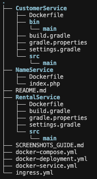
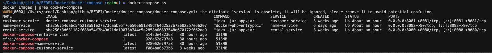
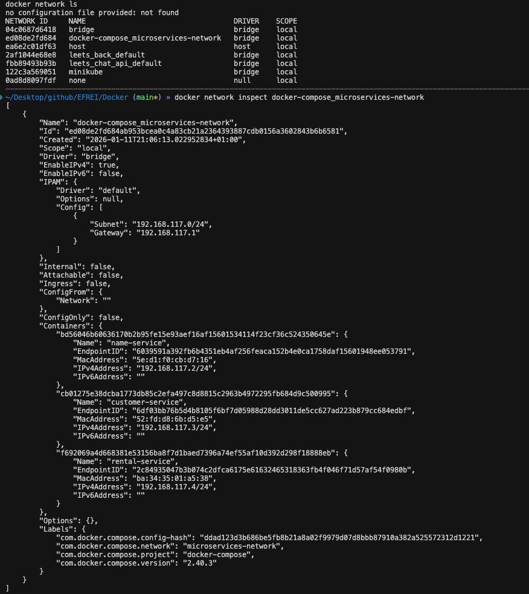
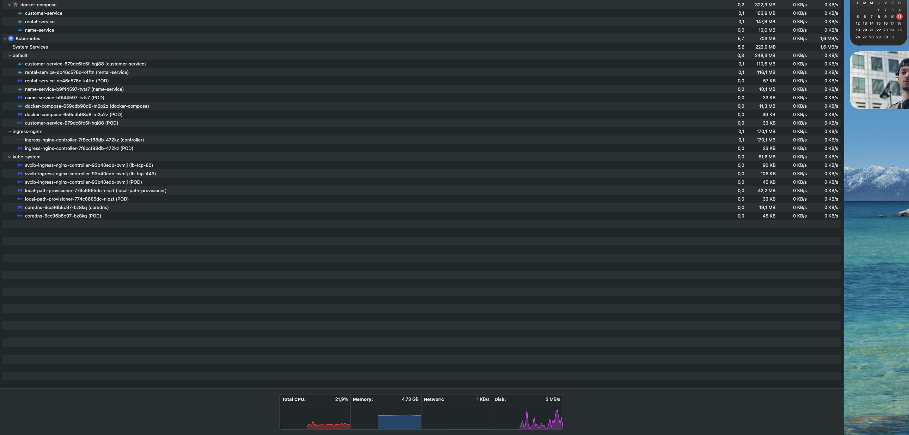
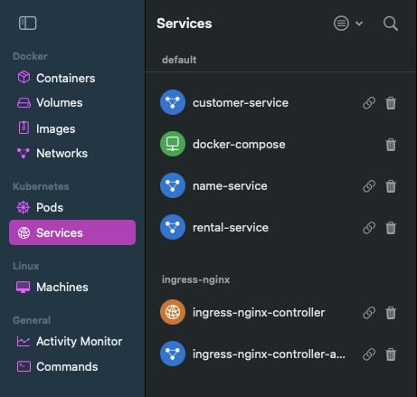
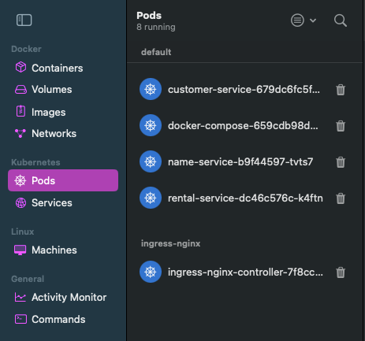

# Projet Microservices : Docker & Kubernetes


## 📋 Table des matières

- [Description du projet](#description-du-projet)
- [Architecture](#architecture)
- [Galerie de démonstration](#-galerie-de-démonstration)
- [Prérequis](#prérequis)
- [Déploiement avec Docker Compose](#-déploiement-avec-docker-compose)
- [Déploiement avec Kubernetes](#-déploiement-avec-kubernetes)
- [Minikube](#-minikube)
- [Commandes essentielles](#-commandes-essentielles)
- [Dépannage](#-dépannage)
- [Screenshots suggérés](#-screenshots-suggérés)

---

## Description du projet

Ce projet illustre une **architecture microservices** avec trois services REST déployés via Docker et Kubernetes :

- **CustomerService** : Gestion des clients (port 8081) - Java/Spring Boot
- **RentalService** : Gestion des locations de voitures (port 8080) - Java/Spring Boot  
- **NameService** : Service de gestion de noms (port 8082) - PHP

### Fonctionnalités démontrées

✅ **Polyglossie** : Utilisation de plusieurs langages (Java, PHP)  
✅ **Orchestration Docker** : Déploiement avec Docker Compose  
✅ **Orchestration Kubernetes** : Déploiement avec Kubernetes  
✅ **Communication inter-services** : Services qui communiquent entre eux  
✅ **Réseau isolé** : Réseau Docker/Kubernetes pour la communication  
✅ **Ingress** : Exposition des services via un Ingress Controller

---

## Architecture

### Architecture Docker Compose

```
┌──────────────────────────────────────────────────────────────┐
│                    Navigateur / Client                        │
│         http://localhost:8080/8081/8082                      │
└──────┬──────────────────┬──────────────────┬─────────────────┘
       │                  │                  │
┌──────▼──────┐  ┌────────▼─────────┐  ┌─────▼──────────┐
│RentalService│  │ CustomerService  │  │  NameService   │
│ (port 8080) │  │  (port 8081)     │  │  (port 8082)   │
│             │  │                  │  │                │
│ Java/Spring │  │  Java/Spring     │  │     PHP        │
│             │  │                  │  │                │
│ - GET /cars │  │ - GET /customers │  │ - GET /        │
│ - GET       │──┤ - GET /customers/│  │ - POST /       │
│   /customer/│  │   {name}/address │  │                │
└─────────────┘  └──────────────────┘  └────────────────┘
       │                  │                  │
       └──────────────────┴──────────────────┘
                         │
              ┌──────────▼──────────┐
              │   Docker Network     │
              │ microservices-network│
              └──────────────────────┘
```

### Architecture Kubernetes

```
┌─────────────────────────────────────────────────────────────┐
│                      Ingress Controller                      │
│                     (Nginx Ingress)                          │
└──────────────┬──────────────────┬──────────────────┬────────┘
               │                  │                  │
      ┌────────▼─────────┐ ┌─────▼──────┐  ┌───────▼────────┐
      │  Rental Service  │ │ Customer   │  │  Name Service  │
      │   Deployment     │ │ Service    │  │   Deployment   │
      │   + Service      │ │ Deployment │  │   + Service    │
      │                  │ │ + Service  │  │                │
      │   ┌──────────┐   │ │            │  │   ┌──────────┐ │
      │   │   Pod    │   │ │  ┌──────┐  │  │   │   Pod    │ │
      │   │  :8080   │   │ │  │ Pod  │  │  │   │   :80    │ │
      │   └──────────┘   │ │  │ :8081│  │  │   └──────────┘ │
      └──────────────────┘ │  └──────┘  │  └────────────────┘
                           └────────────┘
                                  │
                         ┌────────▼─────────┐
                         │  Kubernetes      │
                         │  DNS Service     │
                         └──────────────────┘
```

---

## 📸 Galerie de démonstration

Cette section présente des captures d'écran illustrant le fonctionnement du projet.

### Figure 1 : Vue d'ensemble Docker Compose



*Capture montrant les services Docker Compose en cours d'exécution avec `docker-compose ps`*

---

### Figure 2 : Déploiement Kubernetes



*Vue des deployments et pods Kubernetes pour les trois microservices*

---

### Figure 3 : Tests fonctionnels


*Tests des différents endpoints des services (CustomerService, RentalService, NameService)*

---

### Figure 3.1 : Communication inter-services



*Démonstration de la communication entre les services, notamment l'appel du RentalService vers le CustomerService*

---

### Figure 4 : Kubernetes - Vue détaillée



*vue d'ensemble sur tous les services actifs*
---

### Services



*Tests des endpoints avec les réponses des services*

---

### Pods



---

## Prérequis

### Outils nécessaires

```bash
# Docker
docker --version          # Version 20.10+
docker-compose --version  # Version 2.0+

# Kubernetes (optionnel - pour déploiement K8s)
kubectl version --client  # Version 1.28+

# Minikube (optionnel - pour cluster local)
minikube version          # Version 1.31+
```

### Installation

**macOS (Homebrew) :**
```bash
brew install docker docker-compose kubectl minikube
```

**Linux :**
```bash
# Docker
curl -fsSL https://get.docker.com -o get-docker.sh
sudo sh get-docker.sh

# kubectl
curl -LO "https://dl.k8s.io/release/$(curl -L -s https://dl.k8s.io/release/stable.txt)/bin/linux/amd64/kubectl"
sudo install -o root -g root -m 0755 kubectl /usr/local/bin/kubectl

# Minikube
curl -LO https://storage.googleapis.com/minikube/releases/latest/minikube-linux-amd64
sudo install minikube-linux-amd64 /usr/local/bin/minikube
```

---

## 🐳 Déploiement avec Docker Compose

### Structure du projet

```
docker-compose/
├── CustomerService/         # Microservice Java/Spring Boot
│   ├── src/
│   ├── build.gradle
│   └── Dockerfile
├── RentalService/          # Microservice Java/Spring Boot
│   ├── src/
│   ├── build.gradle
│   └── Dockerfile
├── NameService/            # Microservice PHP
│   ├── index.php
│   └── Dockerfile
├── docker-compose.yml      # Configuration Docker Compose
├── docker-deployment.yml   # Configuration Kubernetes
├── docker-service.yml      # Services Kubernetes
└── ingress.yml             # Configuration Ingress
```

### 1. Construction et démarrage

```bash
# Construire les images et démarrer les services
docker-compose up --build

# En arrière-plan (mode détaché)
docker-compose up -d --build
```

**Ce qui se passe :**
1. Docker lit `docker-compose.yml`
2. Construit les images pour chaque service
3. Crée le réseau `microservices-network`
4. Démarre les services dans l'ordre (selon `depends_on`)
5. Expose les ports 8080, 8081, 8082

### 2. Vérifier les services

```bash
# Lister les conteneurs
docker-compose ps

# Voir les logs
docker-compose logs -f

# Voir les logs d'un service spécifique
docker-compose logs -f customer-service
```

### 3. Tester les endpoints

**CustomerService (port 8081) :**
```bash
# Liste des clients
curl http://localhost:8081/customers

# Adresse d'un client
curl http://localhost:8081/customers/Jean%20Dupont/address
```

**RentalService (port 8080) :**
```bash
# Liste des voitures
curl http://localhost:8080/cars

# Communication inter-services
curl http://localhost:8080/customer/Jean%20Dupont
```

**NameService (port 8082) - PHP :**
```bash
# GET : Retourne le prénom
curl http://localhost:8082/

# POST : Envoyer un nom
curl -X POST http://localhost:8082/ \
  -H "Content-Type: application/json" \
  -d '{"nom": "Jean"}'
```

### 4. Arrêter les services

```bash
# Arrêter (conteneurs conservés)
docker-compose stop

# Arrêter et supprimer
docker-compose down

# Arrêter et supprimer volumes
docker-compose down -v
```

---

## ☸️ Déploiement avec Kubernetes

### Option 1 : Minikube (Cluster local)

#### 1. Démarrer Minikube

```bash
# Démarrer minikube
minikube start

# Vérifier le statut
minikube status

# Obtenir l'IP de minikube
minikube ip

# Activer l'addon Ingress
minikube addons enable ingress
```

#### 2. Configurer Docker pour Minikube

```bash
# Configurer Docker pour utiliser le daemon de minikube
eval $(minikube docker-env)

# Vérifier (vous devriez voir les images de minikube)
docker images
```

#### 3. Construire les images

```bash
# Construire les images dans le contexte de minikube
docker build -t docker-compose-customer-service:latest ./CustomerService
docker build -t docker-compose-rental-service:latest ./RentalService
docker build -t docker-compose-name-service:latest ./NameService

# Vérifier que les images sont présentes
minikube image ls | grep docker-compose
```

#### 4. Déployer sur Kubernetes

```bash
# Appliquer les deployments
kubectl apply -f docker-deployment.yml

# Appliquer les services
kubectl apply -f docker-service.yml

# Appliquer l'ingress
kubectl apply -f ingress.yml

# Vérifier le déploiement
kubectl get deployments
kubectl get services
kubectl get pods
kubectl get ingress
```

#### 5. Accéder aux services

**Via Port-Forward :**
```bash
# Terminal 1
kubectl port-forward service/customer-service 8081:8081

# Terminal 2
kubectl port-forward service/rental-service 8080:8080

# Terminal 3
kubectl port-forward service/name-service 8082:80
```

**Via Ingress (après activation) :**
```bash
# Obtenir l'IP de minikube
MINIKUBE_IP=$(minikube ip)

# Tester les endpoints
curl http://$MINIKUBE_IP/customers
curl http://$MINIKUBE_IP/rentals
curl http://$MINIKUBE_IP/name
```

**Via Minikube Service :**
```bash
# Ouvrir dans le navigateur
minikube service customer-service
minikube service rental-service
minikube service name-service
```

### Option 2 : Cluster Kubernetes existant

Si vous avez accès à un cluster Kubernetes (GKE, EKS, AKS, etc.) :

#### 1. Configurer kubectl

```bash
# Vérifier le contexte
kubectl config current-context

# Lister les contextes
kubectl config get-contexts

# Changer de contexte si nécessaire
kubectl config use-context <nom-contexte>
```

#### 2. Push des images vers un registry

```bash
# Taguer les images
docker tag docker-compose-customer-service:latest <registry>/customer-service:latest
docker tag docker-compose-rental-service:latest <registry>/rental-service:latest
docker tag docker-compose-name-service:latest <registry>/name-service:latest

# Pousser vers le registry
docker push <registry>/customer-service:latest
docker push <registry>/rental-service:latest
docker push <registry>/name-service:latest
```

#### 3. Mettre à jour les deployments

Modifiez `docker-deployment.yml` pour utiliser les images du registry :
```yaml
image: <registry>/customer-service:latest
imagePullPolicy: Always
```

#### 4. Déployer

```bash
kubectl apply -f docker-deployment.yml
kubectl apply -f docker-service.yml
kubectl apply -f ingress.yml
```

### Configuration Kubernetes détaillée

#### Deployments

Les fichiers `docker-deployment.yml` définissent :
- **Replicas** : Nombre de copies de chaque service (1 par défaut)
- **Resources** : Limites CPU/Mémoire
- **Environment Variables** : Configuration des services
- **Image Pull Policy** : `IfNotPresent` pour utiliser les images locales

#### Services

Les fichiers `docker-service.yml` définissent :
- **Type** : `ClusterIP` (interne au cluster)
- **Ports** : Mapping des ports
- **Selectors** : Correspondance avec les pods via labels

#### Ingress

Le fichier `ingress.yml` configure :
- **Host** : `localhost` (ou votre domaine)
- **Paths** : Routes vers chaque service
  - `/customers` → Customer Service
  - `/rentals` → Rental Service
  - `/name` → Name Service

---

## 🔧 Commandes essentielles

### Docker Compose

```bash
# Démarrer
docker-compose up -d

# Arrêter
docker-compose down

# Reconstruire
docker-compose build --no-cache
docker-compose up -d --build

# Logs
docker-compose logs -f <service>

# Exécuter une commande dans un conteneur
docker-compose exec <service> bash
```

### Kubernetes

```bash
# Voir les ressources
kubectl get pods
kubectl get deployments
kubectl get services
kubectl get ingress

# Voir les détails
kubectl describe pod <pod-name>
kubectl describe deployment <deployment-name>
kubectl describe service <service-name>

# Logs
kubectl logs <pod-name>
kubectl logs -f <pod-name>
kubectl logs deployment/<deployment-name>

# Exécuter une commande dans un pod
kubectl exec -it <pod-name> -- /bin/bash

# Port-forward
kubectl port-forward service/<service-name> <local-port>:<pod-port>

# Redémarrer un deployment
kubectl rollout restart deployment/<deployment-name>

# Voir les événements
kubectl get events --sort-by='.lastTimestamp'
```

### Minikube

   ```bash
# Démarrer/Arrêter
minikube start
minikube stop

# Status
minikube status
minikube ip

# Addons
minikube addons list
minikube addons enable ingress
minikube addons enable dashboard

# Services
minikube service <service-name>
minikube service list

# Dashboard
minikube dashboard

# Images
minikube image ls
```

---

## 🐛 Dépannage

### Docker Compose

**Les services ne démarrent pas :**
```bash
# Vérifier les logs
docker-compose logs

# Vérifier les ports
lsof -i :8080
lsof -i :8081
lsof -i :8082

# Reconstruire depuis zéro
docker-compose down -v
docker-compose build --no-cache
docker-compose up -d
```

**Communication entre services impossible :**
- Vérifier que les services sont sur le même réseau
- Utiliser le nom du service (pas `localhost`) dans les URLs
- Vérifier les variables d'environnement

### Kubernetes

**Pods en `ImagePullBackOff` :**
```bash
# Vérifier que l'image existe
kubectl describe pod <pod-name>

# Pour minikube, vérifier que Docker est configuré
eval $(minikube docker-env)
docker images | grep docker-compose

# Mettre à jour imagePullPolicy si nécessaire
kubectl patch deployment <deployment-name> -p '{"spec":{"template":{"spec":{"containers":[{"name":"<container-name>","imagePullPolicy":"Never"}]}}}}'
```

**Pods en `CrashLoopBackOff` :**
```bash
# Voir les logs
kubectl logs <pod-name>

# Voir les événements
kubectl describe pod <pod-name>

# Vérifier les ressources
kubectl top pod <pod-name>
```

**Services non accessibles :**
```bash
# Vérifier que le service pointe vers les bons pods
kubectl get endpoints <service-name>

# Tester la connectivité depuis un pod
kubectl run -it --rm debug --image=busybox --restart=Never -- nslookup <service-name>
```

**Ingress ne fonctionne pas :**
```bash
# Vérifier que l'Ingress Controller est installé
kubectl get pods -n ingress-nginx

# Vérifier l'Ingress
kubectl describe ingress <ingress-name>

# Voir les logs de l'Ingress Controller
kubectl logs -n ingress-nginx -l app.kubernetes.io/component=controller
```

### Minikube

**Minikube ne démarre pas :**
```bash
# Voir les logs
minikube logs

# Supprimer et recréer
minikube delete
minikube start

# Vérifier les ressources
minikube status
```

**Images non trouvées :**
```bash
# Vérifier le contexte Docker
eval $(minikube docker-env)
docker images

# Reconstruire les images
docker build -t <image-name> .
```

---

## 📸 Screenshots suggérés

### 1. Architecture et Structure
- [ ] **Diagramme d'architecture** : Schéma montrant les 3 services et leur communication
- [ ] **Structure des fichiers** : Arborescence du projet dans l'IDE
- [ ] **Dockerfiles** : Capture d'écran des Dockerfiles de chaque service

### 2. Docker Compose
- [ ] **docker-compose.yml** : Vue complète du fichier de configuration
- [ ] **docker-compose ps** : Liste des conteneurs en cours d'exécution
- [ ] **docker-compose logs** : Logs des services
- [ ] **docker images** : Liste des images Docker construites
- [ ] **docker network ls** : Réseaux Docker créés

### 3. Kubernetes - Vue d'ensemble
- [ ] **kubectl get all** : Vue d'ensemble de toutes les ressources
- [ ] **kubectl get pods** : Liste des pods avec leur statut
- [ ] **kubectl get deployments** : Liste des deployments
- [ ] **kubectl get services** : Liste des services avec leurs IPs
- [ ] **kubectl get ingress** : Configuration de l'Ingress

### 4. Kubernetes - Détails
- [ ] **kubectl describe pod** : Détails d'un pod (événements, état, etc.)
- [ ] **kubectl describe deployment** : Détails d'un deployment
- [ ] **kubectl describe service** : Détails d'un service (endpoints, selector)
- [ ] **kubectl describe ingress** : Configuration détaillée de l'Ingress

### 5. Kubernetes - Logs et Monitoring
- [ ] **kubectl logs** : Logs d'un pod spécifique
- [ ] **kubectl top pods** : Utilisation CPU/Mémoire des pods
- [ ] **kubectl get events** : Événements Kubernetes récents
- [ ] **Minikube dashboard** : Interface web du dashboard Kubernetes

### 6. Tests et Requêtes
- [ ] **curl GET** : Test du CustomerService avec curl
- [ ] **curl POST** : Test du NameService avec POST
- [ ] **Communication inter-services** : Logs montrant l'appel entre services
- [ ] **Réponse dans le navigateur** : Résultat affiché dans le navigateur

### 7. Minikube
- [ ] **minikube status** : Statut de minikube
- [ ] **minikube ip** : Adresse IP de minikube
- [ ] **minikube dashboard** : Capture du dashboard Kubernetes
- [ ] **minikube service** : Service ouvert dans le navigateur

### 8. Commandes et Configuration
- [ ] **docker-compose.yml** : Configuration complète avec commentaires
- [ ] **docker-deployment.yml** : Fichier de déploiement Kubernetes
- [ ] **docker-service.yml** : Fichier de services Kubernetes
- [ ] **ingress.yml** : Configuration Ingress

### 9. Terminal et Shell
- [ ] **docker-compose up** : Sortie de la commande de démarrage
- [ ] **kubectl apply** : Application des ressources Kubernetes
- [ ] **docker build** : Construction des images
- [ ] **kubectl port-forward** : Redirection de port en cours

### 10. Interface Graphique (si disponible)
- [ ] **Docker Desktop** : Vue des conteneurs dans Docker Desktop
- [ ] **Kubernetes Dashboard** : Vue d'ensemble dans le dashboard
- [ ] **OrbStack** : Interface d'OrbStack si utilisé

### 11. Dépannage
- [ ] **kubectl describe pod (erreur)** : Pod en erreur avec détails
- [ ] **docker-compose logs (erreur)** : Logs d'erreur
- [ ] **kubectl get events** : Événements d'erreur

### 12. Tests finaux
- [ ] **Tous les services fonctionnels** : curl réussis sur tous les endpoints
- [ ] **Communication inter-services** : Logs montrant la communication
- [ ] **Health checks** : Vérification de santé des services

---

## 📚 Ressources supplémentaires

### Documentation officielle
- [Docker Documentation](https://docs.docker.com/)
- [Docker Compose Documentation](https://docs.docker.com/compose/)
- [Kubernetes Documentation](https://kubernetes.io/docs/)
- [Minikube Documentation](https://minikube.sigs.k8s.io/docs/)

### Tutoriels
- [Kubernetes Basics](https://kubernetes.io/docs/tutorials/kubernetes-basics/)
- [Docker Compose Tutorial](https://docs.docker.com/compose/gettingstarted/)

### Outils
- [Kubernetes Dashboard](https://kubernetes.io/docs/tasks/access-application-cluster/web-ui-dashboard/)
- [k9s - Terminal UI](https://k9scli.io/)
- [Lens - Kubernetes IDE](https://k8slens.dev/)

---

## 📝 Notes importantes

### Variables d'environnement

Les services Spring Boot utilisent des variables d'environnement pour la configuration :
- `SPRING_APPLICATION_NAME` : Nom de l'application
- `SERVER_PORT` : Port d'écoute
- `CUSTOMER_SERVICE_URL` : URL du CustomerService (pour RentalService)

### Communication inter-services

Dans Kubernetes, les services communiquent via leurs noms DNS :
- `customer-service:8081` (pas `localhost:8081`)
- Le DNS Kubernetes résout automatiquement ces noms

### Polyglossie

Ce projet démontre l'utilisation de plusieurs langages :
- **Java** : CustomerService et RentalService (Spring Boot)
- **PHP** : NameService (Apache + PHP)

---

## 🎯 Objectifs pédagogiques

Ce projet permet de comprendre :
1. ✅ L'orchestration de conteneurs avec Docker Compose
2. ✅ Le déploiement sur Kubernetes
3. ✅ La communication inter-services
4. ✅ La configuration de réseaux isolés
5. ✅ L'utilisation d'Ingress pour exposer les services
6. ✅ La gestion des ressources (CPU, Mémoire)
7. ✅ Le debugging et le monitoring

---

## 📞 Support

Pour toute question ou problème :
1. Vérifier la section [Dépannage](#-dépannage)
2. Consulter les logs : `docker-compose logs` ou `kubectl logs`
3. Vérifier la documentation officielle

---

**Bon déploiement ! 🚀**
